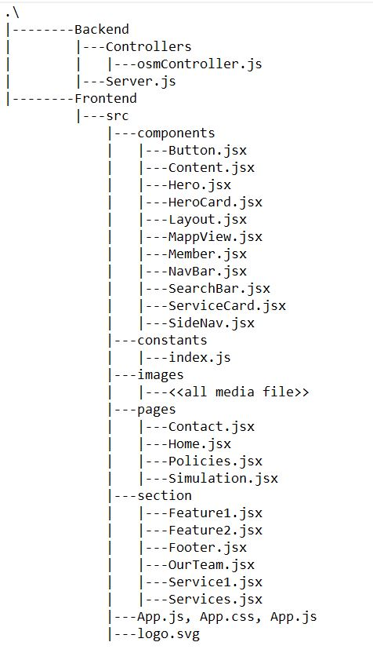

# Traffic and Urban Mobility Simulation

This project aims to simulate urban traffic and mobility patterns to analyze efficiency, reduce congestion, and improve urban planning. It provides insights for traffic flow during peak and non-peak times, congestion mitigation, and environmental impact evaluation.

## Features
- Traffic flow simulation
- Congestion analysis
- Integration of real-world data for accurate modeling
- User-friendly interface for inputting data and analyzing results

### Project link: https://traffic-pulse-eight.vercel.app/

## Prerequisites
To run this project, you need the following:
1. **SUMO (Simulation of Urban MObility)**: Download and set up SUMO. Please refer to the attachment [ProjectReport.pdf](./attachments/ProjectReport.pdf) for installation instructions.
2. **Node.js and npm**: Ensure you have Node.js and npm installed.

## Project Structure
- **Frontend**: Built with React, it provides a GUI interface for visualizing simulations.
- **Backend**: Built with Node.js, it manages traffic control algorithms and simulation logic.
- **SUMO Integration**: SUMO is used for traffic simulation and data processing.

Here is the project folder:



## Installation and Setup

### Clone the Repository
```bash
git clone https://github.com/yourusername/traffic-mobility-simulation.git
cd traffic-mobility-simulation
```

### Install Dependencies

#### Frontend
```bash
cd frontend
npm install
```

#### Backend
```bash
cd ../backend
npm install
```


### SUMO Setup
Follow the instructions to install sumo go to the attachments [SUMO_Setup.msi](./attachments/sumo-win64-1.20.0.msi) to set up SUMO on your system.

## Running the Project

1. Start the backend server:
   ```bash
   cd backend
   npm start
   ```

2. Start the frontend:
   ```bash
   cd ../frontend
   npm start
   ```

3. Open your browser and navigate to `http://localhost:5000` to access the application.

## Usage
1. Upload `.osm` map files for simulation.
2. Configure the simulation parameters such as traffic density and vehicle types.
3. Start the simulation to analyze traffic patterns and urban mobility.

## Technologies Used
- **Frontend**: React, Leaflet.js, Tailwind CSS
- **Backend**: Node.js
- **SUMO**: For traffic simulation
- **TraCI API**: For integrating SUMO with the project

## Contributing
Contributions are welcome! Please fork this repository and submit a pull request for any changes.


---

### Attachments
- [ProjectReport.pdf](./attachments/ProjectReport.pdf)
- [SUMO Installation](https://sumo.dlr.de/docs/Installing/index.html)
- [Presentation Video](https://drive.google.com/file/d/1yz234a6mAZ-C959Cju_JtOqLu3OWUXyk/view)
